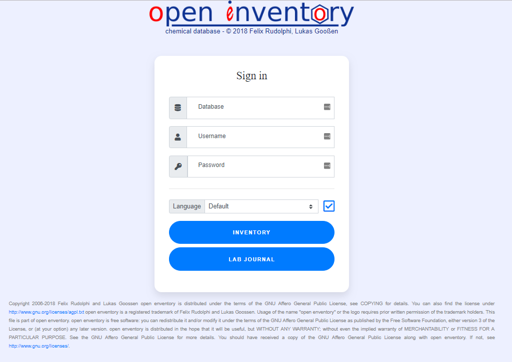
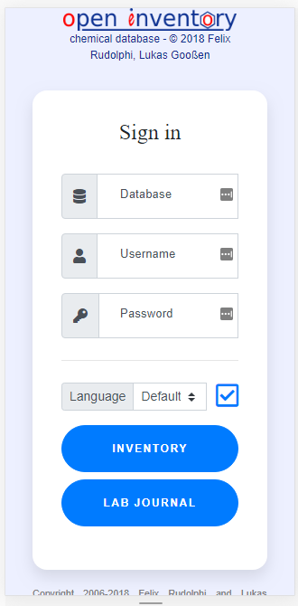
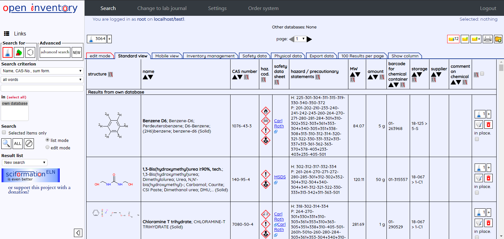

# OPEN ENVENTORY

## Table of contents

- [OPEN ENVENTORY](#OPEN-ENVENTORY)
  - [Table of contents](#Table-of-contents)
  - [General info](#General-info)
  - [Technology](#Technology)
  - [Setup](#Setup)
  - [User manual](#User-manual)
  - [Version](#Version)
  - [Screenshots](#Screenshots)

## General info

Github for published Open Enventory for easy development

Original source: https://sourceforge.net/projects/enventory/

Open Enventory is free software. You may redistribute copies of it under the terms of the GNU Affero General Public License V3 http://www.gnu.org/licenses/agpl.html. There is no warranty, to the extent permitted by law.

- Development: Prof. Dr. Lukas Gooßen and Dr. Felix Rudolphi.  
- Open Enventory is a registered trademark of Felix Rudolphi and Lukas Gooßen.  
- Programming: Felix Rudolphi and Thorsten Bonck.  

This repository is made by Dr. Khoi Van for easy creation of forked modification. I don't own any of the code except for the modified one.

For more detail about Open Enventory and why you should use it, you can look at this [presentation](https://www.dropbox.com/s/a1a44trp7imqfkx/Khoi%20Van%20-%20OE%20introduction%20-%2020191015%20-%20compressed.pptx?dl=0). 
**Note**: This presentation includes videos as demonstration so you might have to download it to be able to play it correctly.

## Technology

- PHP 5+
- MySQL
- HTML5, Javascript
- Bootstrap 4

## Setup

To run this program:
- Consult this [general installation guideline for this project](http://enventory.chemie.uni-kl.de/inventar/INSTALL/INSTALL.html)

If you are a beginner, you can follow step-by-step guideline for:
- Windows: using XAMPPS [link](docs/Open_Enventory_Win_installation_20150303.pdf)
- Mac: using XAMPPS [link](docs/Open_Enventory_Mac_installation_20180713.pdf)
- Centos 7: [link](docs/Open_Enventory_Centos7_installation_20190517.pdf)

## User manual

- [Brief user manual for Inventory part](docs/Open_Enventory_Manual.pdf)

## Version

[Versions detail](VERSION.md)

## Screenshots

- Login page on laptop (Win10/Chrome): 20190717

- Login page on mobile (Android/Chrome): 20190717

- New user interface: 20190717

